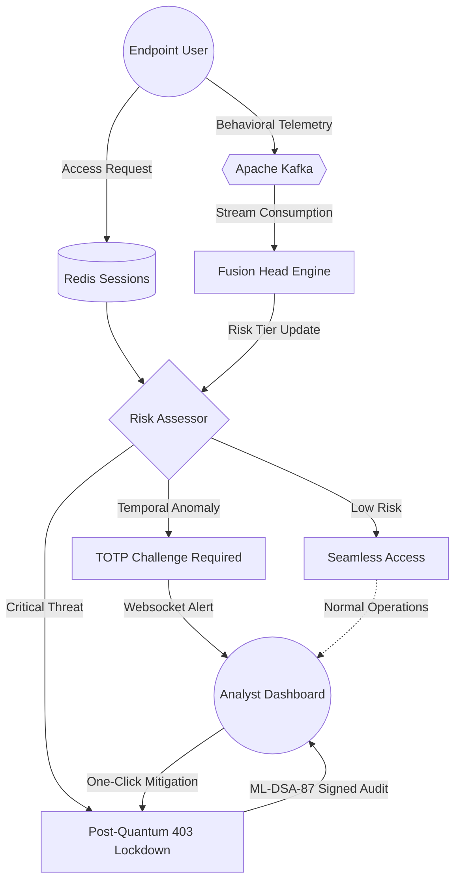

# Astra-Q: Advanced Security Threat Response Architecture – Quantum

Astra-Q is an enterprise-grade, continuous trust intelligence and insider threat detection platform designed for modern, high-security ecosystems (like Next-Gen Banking and Aerospace). Instead of relying on static-perimeter security, Astra-Q continuously evaluates behavioral telemetry, dynamically scoring user trust anomalies alongside Post-Quantum Cryptography (PQC) to defend against inside threats and data exfiltration natively.

---

## Tech Stack

**Frontend Framework**: Next.js 14, React 18
**Styling & UI**: Tailwind CSS, Framer Motion, Recharts
**Backend API**: FastAPI (Python 3.10+) 
**Machine Learning Engine**: DGL (GCN), Scikit-Learn (Isolation Forest, Random Forest), PyTorch
**Real-Time Data Ingestion**: Apache Kafka, Zookeeper, WebSockets
**Target LLM Model**: Groq (Llama-3-8b)
**Cryptographic Primitives**: `liboqs-python` (ML-KEM / ML-DSA)
**Caching & Session Storage**: Redis
**Infrastructure / Deployment**: Docker / Docker Compose

---

## Technical Architecture

Astra-Q employs an ultra-scalable, service-oriented architecture bridging real-time event streaming, Artificial Intelligence, and cryptographic resilience. 

### 1. Data Ingestion & Stream Processing
* **Apache Kafka & Zookeeper**: The nervous system of Astra-Q. Raw behavioral telemetry (keystrokes, file access, peripheral devices, login patterns) generated by corporate endpoints is published directly to Kafka topics (e.g., `aegis.telemetry`).
* **WebSocket Relays**: Operating out of the FastAPI backend, active websockets consume these Kafka streams to push zero-latency data directly into the React/Next.js client interface. Analysists watch the ecosystem react dynamically.

### 2. Core Detection Engine (Machine Learning Pipeline)
To accurately isolate rogue activity without interrupting legitimate employees, Astra-Q deploys an ensemble Machine Learning model called the **Fusion Head**:
* **Heterogeneous Graph Convolutional Network (HeteroGCN)**: Models the complex interconnected topologies of the company (Users → PCs → Files). An employee accessing a file type previously untouched by their peer-group immediately spikes connection weights.
* **Psychometric Normalization**: Handles localized temporal shifts. Implements **Isolation Forests** (for raw outlier detection) and **Random Forests** (supervised historical pattern classification) to contextualize data based on "time-of-day" behaviors.
* **Sequential Transformers**: Designed specifically to spot long-form, drawn-out exfiltration methods that evade traditional SIEM log scraping by maintaining state awareness of chronologic sequences.
* **Risk Output**: These pipelines fuse to classify the user into four dynamic tiers: **Low, Medium, High, or Critical**.

### 3. Post-Quantum Cryptographic (PQC) Security Layer
Astra-Q is built to withstand threats from the impending quantum computing era by implementing Open Quantum Safe (`liboqs`) Native C bindings wrapped for Python:
* **ML-KEM-1024 (Kyber)**: Utilized for Key Encapsulation Mechanisms (KEM) to facilitate quantum-resistant transport tunnels beyond traditional TLS algorithms. 
* **ML-DSA-87 (Dilithium)**: Used as the immutable source of truth. Every mitigation executed and every threat isolated is digitally signed using Dilithium signatures. They are stored securely into the `pqc_keys` module, generating unbreakable cryptographic audit logs.

### 4. Interactive Analyst Command Center (Frontend)
* **Next.js 14 / React**: Executing in a highly-optimized `standalone` Docker architecture.
* **Aesthetics**: Fully shifted to a modern "Light-Paste Mint" enterprise design language focusing on high contrast, readability, and glass-morphic depth modeling.
* **Visual Telemetry**: The UI binds real-time data to **Entity Relationship Graphs** identifying threat nodes topologically via colors (Users, PCs, Files).
* **Groq SDK AI Assistant**: Utilizing Llama3-8b, an integrated Chatbot analyzes logs via natural language processing to assist analysts on-the-fly.

---

## Project Structure

The repository is modularly containerized into distinct core environments:

```
astra-q/
│
├── frontend/                 # Interactive Control Center (Next.js 14)
│   ├── src/
│   │   ├── app/              # App router & Page architectures (Dashboard, Reports)
│   │   ├── components/       # Monolythic UI components (ThreatCards, Graph visualizers)
│   │   ├── hooks/            # WebSocket and ThreatData custom hooks
│   │   └── context/          # Authentication & App context states
│   └── Dockerfile            # Container definition utilizing optimized 'standalone' build
│
├── backend/                  # FastAPI Application Engine & Kafka Consumers
│   ├── api/                  # REST Routers and WebSocket ingestion handlers
│   ├── pqc/                  # Native Open-Quantum-Safe integrations (ML-KEM / ML-DSA) 
│   ├── llm/                  # Groq API controllers and Chatbot parsers
│   ├── ingestion/            # Kafka producer algorithms and dataset bridges
│   └── utils/                # Auth logic, JWT issuance, and Redis keywrap logic
│
├── models/                   # Pre-compiled ML models & Model definitions
│   └── train.py              # Supervised Random/Isolation forest compilation script
│
├── infra/                    # Deployment Infrastructure
│   ├── docker-compose.yml    # Master deployment orchestrator
│   └── kafka/                # Broker configuration files (Topics config)
│
└── .env.example              # Template Secrets manifest
```

---

## Setup & Installation

Follow these steps to deploy Astra-Q locally via Docker Compose.

### Requirements
* Docker Desktop / Docker Compose
* Python 3.10+ (if running natively without Docker)
* Node.js & npm (for frontend modifications)
* A valid [Groq API Key](https://console.groq.com/keys) for the AI assistant

### 1. Clone the Repository
```bash
git clone https://github.com/your-org/astra-q.git
cd astra-q
```

### 2. Environment Variables
Copy over the environment template and insert your API keys:
```bash
cp .env.example .env
```
Ensure you have the following secrets defined in `.env`:
```env
FERNET_KEY=<generate_base64_32_byte_key>
GROQ_API_KEY=<your_groq_api_key_here>
```

### 3. Build & Deploy via Docker
Use Docker Compose to provision the backend, frontend, Zookeeper, Kafka, and Redis instances.
```bash
cd infra
docker-compose up --build -d
```
*Note: The backend container will compile the `liboqs` C-library from source during the build phase. This may take a few minutes.*

### 4. Access the Application
Once the containers report healthy, open your browser and navigate to:
* **Analyst Dashboard**: `http://localhost:3000`
* **Backend API Docs (Swagger)**: `http://localhost:8000/docs`

---

## System Workflows

### Architectural Flowchart



### The Admin Login & Authentication Flow
1. **Access Initiation**: The operator queries the Astra-Q Gateway via `/api/auth/request-access`.
2. **Risk Assessment**: The Identity Provider routes the request through a Redis-backed feature cache to analyze the source environment in real time. 
3. **Adaptive Friction**: 
   * If the metrics imply standard operational parameters, passage is granted seamlessly.
   * If temporal or location anomalies are detected, the system triggers the **MFA Challenge**, blocking passage until a secondary cryptographic TOTP token is verified.
   * If catastrophic parameters block identity assurance, the system throws a `403 CRITICAL DENIED` response, halting the login via automated post-quantum containment logs.

### Threat Detection & Mitigation Processing
1. **Continuous Telemetry**: Legitimate operator logs are continuously passed into the Kafka broker. 
2. **Behavioral Shift**: An employee begins batch downloading highly classified files at 3:00 AM on an unauthorized device. The Fusion Head processes this via the Graph and Transformer modules, instantly shifting the risk tier to `CRITICAL`.
3. **Analyst Review**: The Dashboard isolates the event in the UI Alert Panel in milliseconds. Real-time Node Graphs color the affected user and endpoint in deep ambers and reds.
4. **Instant Mitigation**: An analyst invokes the Adaptive Privilege Sliders or triggers a direct "Revoke Connection" payload. This request is passed back to the FastAPI `/api/threats/contain` endpoint, which is instantly evaluated, signed by `ML-DSA-87`, and executed to immediately lock down the network node natively.

---

## Competitive Comparison & Feasibility

Astra-Q represents a paradigm shift against traditional Enterprise Intrusion Systems by enforcing continuous validation alongside algorithmic foresight.

| Feature Area | Astra-Q | Traditional SIEM / IAM |
|:---|:---|:---|
| **Identity Paradigm** | **Continuous Trust Scoring** evaluates intent continuously throughout an active session. | **Static Perimeter Defense** grants unlimited access once a user bypasses the initial password/MFA screen. |
| **Cryptography Standard** | **NIST Post-Quantum Cryptography** (ML-KEM / ML-DSA) securing payloads against quantum decryption. | **Legacy RSA / ECC protocols**, which are fundamentally vulnerable to factorization algorithms (Shor's Algorithm). |
| **Architectural Speed** | **Real-Time Data Streams** directly linking Kafka producers to Websocket frontends for instantaneous action. | **Batch Log Scraping & Indexing** where delays of 10-30 minutes between breach and detection are normal. |
| **Mitigation Action** | **One-Click Micro-segmentation** dynamically locks out specific user paths dynamically from the SOC dashboard. | **Manual scripting** requiring IT ticket handling, leading to response paralysis and broader breaches. |
| **Deployment Feasibility** | **High Feasibility:** Modular Docker deployment using Python/Next.js microservices. Lightweight and horizontally scalable via Kubernetes. | **Low Flexibility:** Heavy monolithic deployment structures requiring immense database replication and rigid configurations. |
